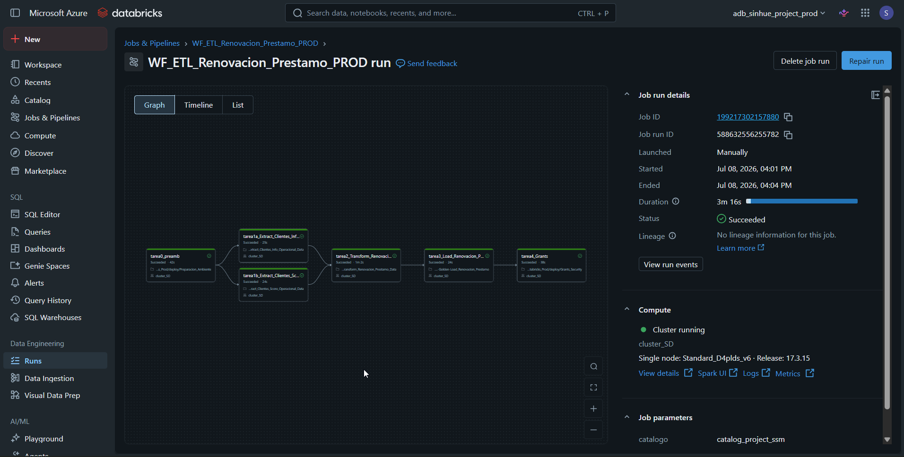
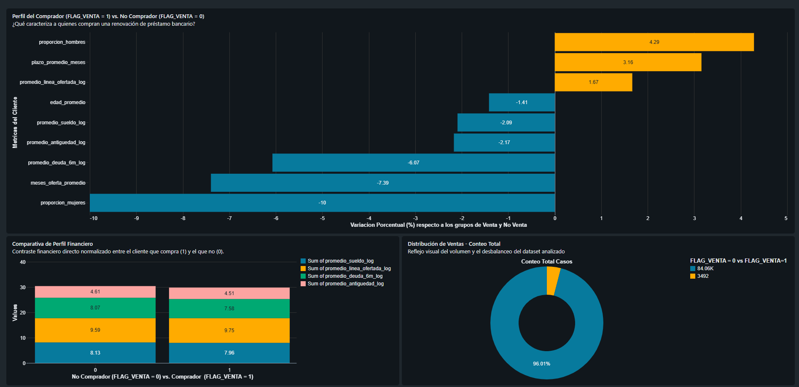
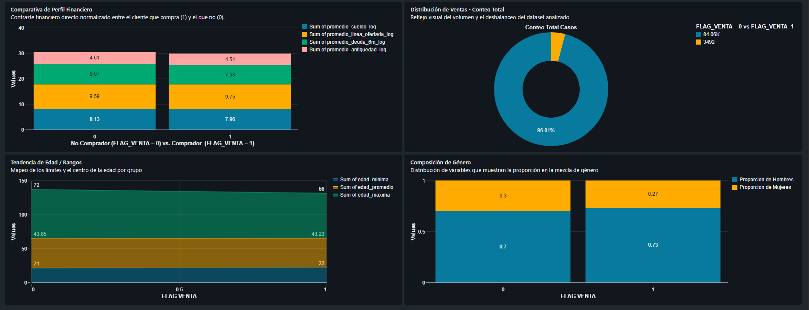

# ✨ Proyecto Pipeline Automatizado con Dataset de Renovacion Prestamo con Databricks
Este proyecto implementa un pipeline de datos (ETL) automatizado utilizando un dataset real de cuestionarios de Call Center. El objetivo es procesar, limpiar y transformar los datos de clientes bancarios para dejarlos listos para un modelo de Machine Learning (Clasificación Binaria) que prediga si un cliente aceptará o no la renovación de un préstamo.

## 🎯 Resumen del Proyecto
- **Origen de los Datos:** Dataset real derivado del proyecto de MLOps: **[renovacion_prestamo_fastapi](https://github.com/SanehetSiordia/renovacion_prestamo_fastapi.git)**.
  - `renovacion_prestamo_clientes_info_operacional.csv`: Datos demográficos y métricas de la campaña telefónica.
  - `renovacion_prestamo_clientes_score_financiero.csv`: Historial financiero, saldos y situación en el Sistema Financiero.
- **Orquestación:** Pipeline automatizado mediante **Databricks Jobs Workflows** (`WF_ETL_Renovacion_Prestamo_PROD`).
- **CI/CD:** Despliegue continuo gestionado con **GitHub Actions**.
- **Gobernanza y Seguridad:** Implementación sobre **Unity Catalog**, conexión a Azure Data Lake mediante **Managed Identity** y gestión de secretos en GitHub.

---

## 🛠️ Stack Tecnológico


---

## 🏗️ Arquitectura de Datos (Medallion Layers)

El pipeline procesa los datos a través de Azure Data Lake Storage Gen2 (ADLS) utilizando el formato **Delta** bajo la siguiente estructura:

| Capa | Ubicación en Storage | Formato | Descripción |
| :--- | :--- | :--- | :--- |
| **Raw** | `container/raw` | CSV | Archivos fuentes originales sin modificaciones. |
| **Bronze** | `container/bronze` | Delta | Ingesta directa de los archivos Raw en las tablas: `renovacion_prestamo_clientes_info_operacional` y `renovacion_prestamo_clientes_score_financiero`. |
| **Silver** | `container/silver` | Delta | Limpieza, joins y transformaciones para la tabla lista para ML: `renovacion_prestamo_transformed`. |
| **Gold** | `container/gold` | Delta | Agregaciones de negocio para graficar reportes con las tablas: `golden_renovacion_prestamo` y `golden_renovacion_prestamo_perfil_comprador`. |

## ⚙️ Guía de Configuración y Despliegue

### Requisitos Previos
1. Cuenta de **Azure Databricks** (Premium o Enterprise para soporte de Unity Catalog).
2. Un Storage Account en Azure (ADLS Gen2) configurado con un **Managed Identity** (Acceso por conector de acceso a datos).
3. Configurar una Credencial de Almacenamiento en Unity Catalog llamada `credential`.

### Pasos para el Despliegue

1. **Preparar el Data Lake:** Crea los contenedores `raw`, `bronze`, `silver` y `golden` en tu ADLS Gen2. Carga los archivos CSV de la carpeta `/datasets` dentro del contenedor `raw`.
2. **Entorno de Desarrollo:** Realiza un *Fork* de este repositorio. En tu Workspace de Databricks de Desarrollo, clona la rama `construccion`.
3. **Entorno de Producción:** Configura tu Workspace productivo y crea un clúster Single Node llamado `cluster_SD`.
4. **Configurar CI/CD:** Agrega los secretos de autenticación de Databricks (`DATABRICKS_ORIGIN_HOST`, `DATABRICKS_ORIGIN_TOKEN`, `DATABRICKS_DEST_HOST` y `DATABRICKS_DEST_TOKEN`) en los secretos de tu repositorio de GitHub.
5. **Validación e Integración:** Realiza tus cambios en la rama `construccion`, haz un `push` y abre un *Pull Request* hacia la rama `main`.
6. **Despliegue Automático:** GitHub Actions validará el código y desplegará automáticamente los Notebooks y el Workflow en el entorno de producción.
7. **Ejecución:** Ve a la sección de *Jobs & Pipelines* en Databricks Producción y ejecuta el Workflow generado: `WF_ETL_Renovacion_Prestamo_PROD`.

---
## 📂 Estructura del Repositorio
```text
.
├── .github/workflows/
│   └── deploy-notebook.yml        # Pipeline de CI/CD (GitHub Actions)
├── PreAmb/
│   └── Preparacion_Ambiente       # Configuración inicial de catálogos y esquemas
├── dashboard/
│   └── *.png                      # Capturas del Databricks Dashboard
├── datasets/
│   ├── clientes_info_operacional.csv
│   └── clientes_score_financiero.csv
├── evidencias/
│   └── *.png                      # Pruebas de infraestructura y Jobs
├── proceso/
│   ├── 1a.-Bronze-Extract_Clientes_Info_Operacional_Data
│   ├── 1b.-Bronze-Extract_Clientes_Score_Operacional_Data
│   ├── 2.-Silver-Transform_Renovacion_Prestamo_Data
│   └── 3.-Golden-Load_Renovacion_Prestamo
├── reversion/
│   └── Reverse                    # Script de rollback / limpieza de entorno
└── seguridad/
    └── Grants_Security            # Asignación de permisos en Unity Catalog
```
---
## 🔄 Workflow Databricks
El flujo de trabajo en Databricks ejecuta las tareas en paralelo para la capa Bronze, y de manera secuencial para las capas Silver y Gold:


---
## 📈 Visualización y Entrega de Datos
Los datos de la capa Gold alimentan tableros interactivos para analizar los perfiles de clientes con mayor probabilidad de aceptación:




---
## 🚀 Próximos Pasos / Roadmap
-  Migrar la arquitectura hacia un entorno local/gratuito para facilitar pruebas locales sin costo de nube.

---
### 👤 Autor
**Sinhue Siordia Millan**